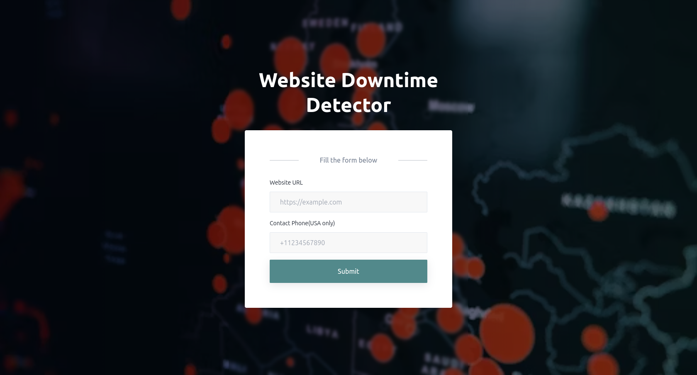

# Downtime Detector

## Table of Contents

- [Overview](#overview)
- [Demo](#demo)
- [Installation](#installation)
- [Usage](#usage)
- [Screenshots](#screenshots)
- [License](#license)

## Overview

Downtime detector is a web app that provides immediate text alerts to users via Twilio sms service when a monitored website goes down.

## Demo

https://downtime-detector.vercel.app/

## Installation

- Clone the project into your local directory.
- npm install to install the server side dependencies.
- cd client & npm install to install the client side dependencies.
- create a .env file in the root and populate it with values as shown in .envExample file.
- npm run server to start the backend.
- In the client directory , npm run dev to start the client. 

## Usage
1. User enters the website URL and phone number and clicks on the submit button. User then receives an OTP from Twilio.
2. A popup modal is displayed to the user asking for the verification code.
3. When the code has been successfully verified and the record has been saved to the database, the user will see an alert that notifies them that their url has been added for monitoring and that they will receive text-alerts whenever their url is down.
6. Users receive an alert once per day if the website is still down. If they click on the snooze url, the website will no longer be monitored for down time. 

Downtime Detector is a web app that I developed to help users get immediate alerts via text whenever a website they are monitoring goes down. The key features of the app include:

- Simple registration process that uses Twilio Verify API to send OTP to the user's phone number, ensuring the system is secure and preventing spam.
- Easy-to-use interface that allows users to enter the URL of the website they want to monitor and get alerted via text when the website goes down.
- Next.js for the frontend, Node.js/Express for the backend, and MongoDB for the database.
- Twilio API for sending SMS alerts to registered phone numbers.
- Node-cron job that runs once per day to check if any website is down, ensuring that the system runs smoothly and alerts users in a timely manner.
- 'Snooze' feature that allows users to pause notifications if they are getting too many alerts.
 
Downtime Detector is a great tool for anyone who wants to ensure that their websites are always up and running, without having to constantly check them manually.

## Screenshots

## License

This project is licensed under the ISC license.

